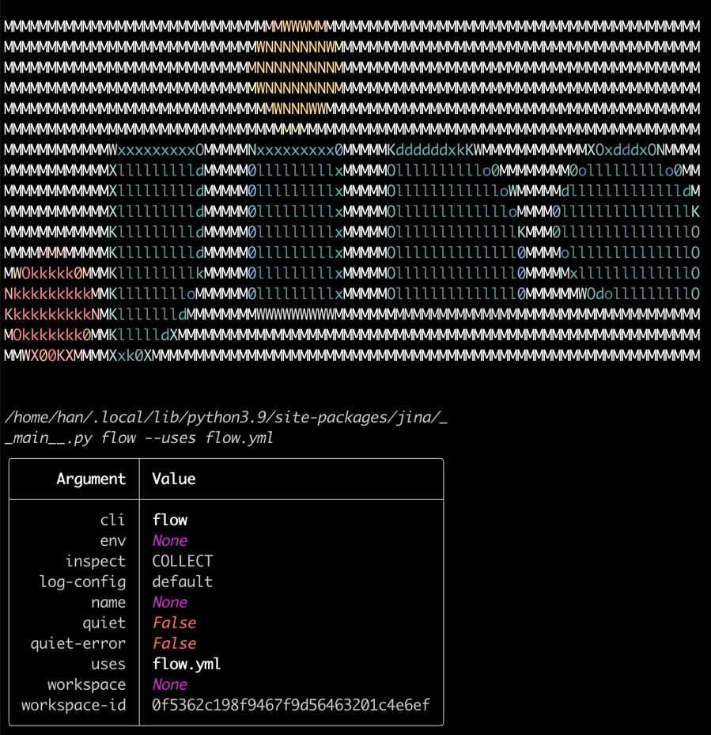
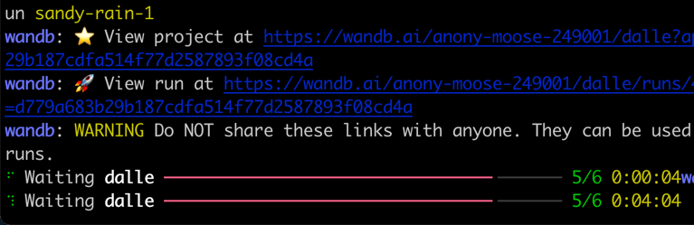

# DALL·E Flow

**Creating HD images from text via DALL·E in a Human-in-the-Loop workflow**

<a href="https://slack.jina.ai"></a>

DALL·E Flow is a workflow for generating images from text prompt. It first leverages [DALL·E-Mega](https://github.com/borisdayma/dalle-mini) to generate image candidates, and then calls [CLIP-as-service](https://github.com/jina-ai/clip-as-service) to rank the candidates w.r.t. the prompt. The preferred candidate is fed to [GLID-3 XL](https://github.com/Jack000/glid-3-xl) for diffusion, which often enriches the texture and background. Finally, the candidate is upscaled to 1024x1024 with [SwinIR](https://github.com/JingyunLiang/SwinIR).

DALL·E Flow is built with [Jina]() in a client-server architecture. This enables DALL·E Flow with high scalability,  non-blocking streaming, and a modern Pythonic API. Client can interact the server via gRPC/Websocket/HTTP with TLS.

## Gallery

## Client

## Server

You can host your own server by following the instruction below.

### Hardware requirements

It is highly recommended to run DALL·E Flow on a GPU machine. In fact, one GPU is probably not enough. DALL·E Mega needs one with 22GB memory. SwinIR and GLID-3 also need one; as they can be spawned on-demandly in seconds, they can share one GPU.

It requires at least 40GB free space on the hard drive, mostly for downloading pretrained models.

CPU-only environment is not tested and likely won't work.


### Install

#### Clone repos

```bash
mkdir dalle && cd dalle
git clone https://github.com/hanxiao/dalle-flow.git
git clone https://github.com/JingyunLiang/SwinIR.git
git clone https://github.com/CompVis/latent-diffusion.git
git clone https://github.com/Jack000/glid-3-xl.git
```

You should have the following folder structure:

```text
dalle/
 |
 |-- dalle-flow/
 |-- SwinIR/
 |-- glid-3-xl/
 |-- latent-diffusion/
```

#### Install auxiliary repos

```bash
cd latent-diffusion && pip install -e . && cd -
cd glid-3-xl && pip install -e . && cd -
```

There are couple models we need to download first for GLID-3-XL:

```bash
wget https://dall-3.com/models/glid-3-xl/bert.pt
wget https://dall-3.com/models/glid-3-xl/kl-f8.pt
wget https://dall-3.com/models/glid-3-xl/finetune.pt
```

#### Install flow

```bash
cd dalle-flow
pip install -r requirements.txt
```

### Start the server

Now you are under `dalle-flow/`, run the following command: 

```bash
jina flow --uses flow.yml
```

You should see this screen immediately:



On the first start it will take ~8 minutes for downloading the DALL·E mega model and other necessary models.



When everything is ready, you will see:


Congrats, now you should be able to [run the client](./client.ipynb).

The second run should only take ~1 minute to reach the address panel.